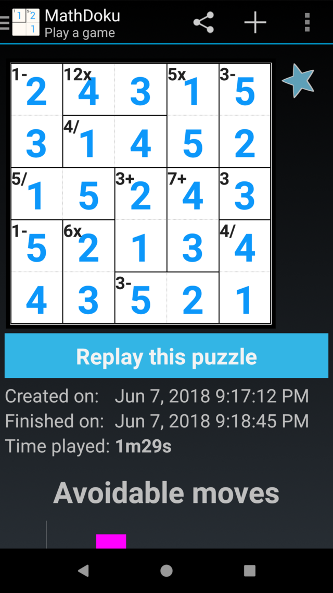

Mathdoku - a game for Android
=============================

Mathdoku is a puzzle similar to Sudoku. Based on the same rules as the
KenKen(tm) game.

The game is [available on Google Play.](https://play.google.com/store/apps/details?id=net.cactii.mathdoku)

How is it played?
-----------------

Place the numbers such that each digit appears once per row and column. The
twist is to ensure each 'cage' solves the given mathematical challenge.

Screenshot
-----------

Licence/Copyright
-----------------

Licenced under the GPL v3.

Copyright 2009-2018 Ben Buxton with contributions.

